# Умное потребление в России, 2024–2026

Исследование потребительского поведения в России на данных
НИУ ВШЭ, Ромир, СберИндекс, Росстат и ВЦИОМ. База — 24 таблицы
в SQLite. Проверяются три гипотезы о природе роста «умного
потребления». Основной вопрос — вынужденная это экономия или
ценностный сдвиг.

## Главный вопрос

Рост «умного потребления» в России 2024–2026 — вынужденная
экономия или ценностный сдвиг. Дополнительный вопрос — кому
этот сдвиг доступен.

## Определение

Умное потребление — поведенческая стратегия выбора товаров
и услуг, направленная на максимизацию полезности при
ограниченном бюджете. В отличие от осознанного потребления
(ценностный выбор в пользу экологии, этики, качества),
умное потребление не предполагает нормативной оценки: оно
может быть как вынужденным, так и добровольным.

## Главный вывод

Умное потребление в России 2024–2026 — избирательная
адаптация, не ценностный сдвиг и не чистое обеднение.
Три гипотезы дают результат разной силы:

- Рост СТМ концентрируется в повседневных категориях.
  Это наблюдение само по себе не различает «чистую
  экономию» и «избирательность» — обе версии предсказывают
  ту же картину. Различающий сигнал — высокая доля
  ценностных мотивов, но базовая линия за прошлые годы
  отсутствует.
- Ценовой компонент индекса «умности» не сдвинулся, хотя
  доля домохозяйств без сбережений и без кредитов выросла
  на 11,9 п.п. за два года. Рост умности связан
  с перестройкой критериев выбора, а не с усилением
  ориентации на цену.
- Возрастная группа 45–54 отстаёт от соседних групп
  по темпу прироста почти в три раза. Направление
  отставания устойчиво, статистическая значимость
  зависит от допущения о размере подгрупп.

## Гипотезы

| | Гипотеза | Статус | Ключевая цифра |
|---|---|---|---|
| H1 | СТМ в повседневных категориях | Описательное наблюдение | 10 из 10 (мягкая) / 8 из 10 (строгая) |
| H2 | Ценовой компонент не растёт | Согласуется с гипотезой | 0 п.п. при давлении +11,9 п.п. |
| H3 | Отставание 45–54 | Направление подтверждено | −4,9 п.п. от соседей, p от 0,006 до 0,173 |

Полное описание метода, результата и ограничений —
в [hypotheses.md](hypotheses.md). Обзор литературы —
в [literature_review.md](literature_review.md).

## Структура репозитория

├── data/
│ ├── raw/ исходный Excel
│ ├── csv/ экспорт таблиц для Power BI
│ └── smart_consumption.db 24 таблицы SQLite
├── r/
│ ├── H1.R проверка H1: СТМ в категориях
│ ├── H2.R проверка H2: ценовой компонент
│ ├── H3.R проверка H3: отставание 45–54
│ └── exploration_categories.R региональный разрез офлайна
├── sql/
│ └── queries.sql аналитические SQL-запросы
├── visualizations/ графики (png)
├── dashboard/ дашборд Power BI
├── hypotheses.md гипотезы, метод, результаты
├── literature_review.md обзор литературы
└── README.md

## Воспроизводимость

**База данных.** Все данные собраны в `data/smart_consumption.db`
(SQLite, 24 таблицы). Структура и источники описаны
в `data/data_dictionary.md`.

**Порядок воспроизведения.**

1. SQL-запросы (`sql/queries.sql`) выполняются в SQLiteBrowser
   или любом другом клиенте к той же базе. Проверяют
   выгрузку данных для гипотез.
2. R-скрипты в `r/` читают базу и строят графики.
   Запускаются независимо друг от друга. Каждый скрипт
   самодостаточен: подключается к базе, считает,
   сохраняет результат в `visualizations/`.

**Пакеты.**

- R: `DBI`, `RSQLite`, `dplyr`, `tidyr`, `ggplot2`,
  `here`, `forcats`, `stringr`.
- Python: `pandas`, `matplotlib`.

## Источники данных

| Источник | Что даёт | Период |
|---|---|---|
| НИУ ВШЭ + «Чижик» (X5) | индекс умного потребления, сегменты | 2024–2025 |
| Ромир | потребительская панель, СТМ, ИПУ | 2026 |
| СберИндекс | транзакции, категории, офлайн | 2025–2026 |
| Росстат / ЕМИСС | оборот розницы, структура расходов | 2025–2026 |
| ВЦИОМ / Anketolog | опрос No Buy | 2025 |
| НИУ ВШЭ, Барометр №2-2026 | сбережения, кредиты, макро-контекст | 2023–2026 |

## Графики

### H1. СТМ в повседневных категориях

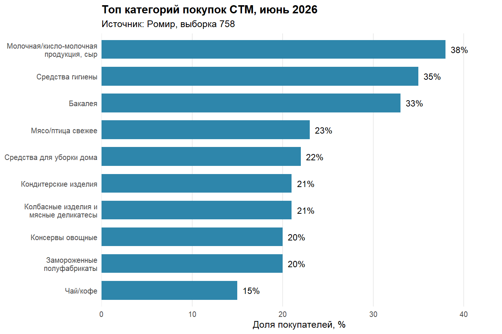

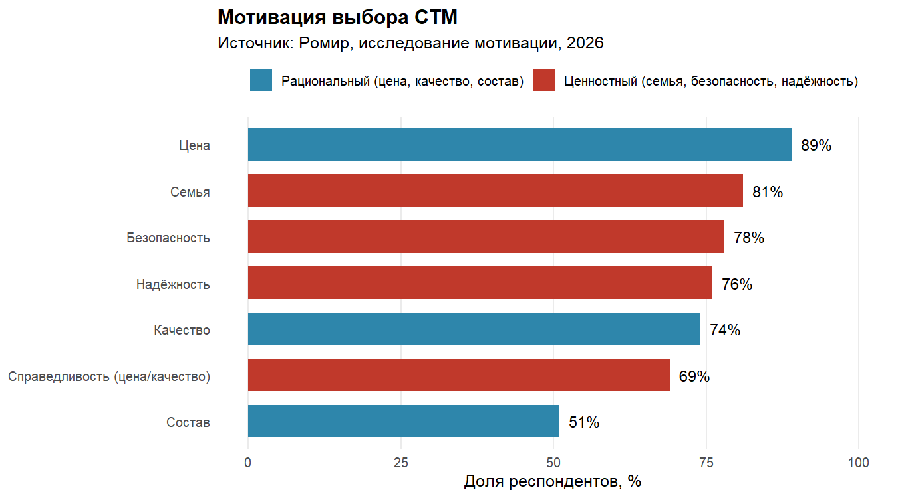

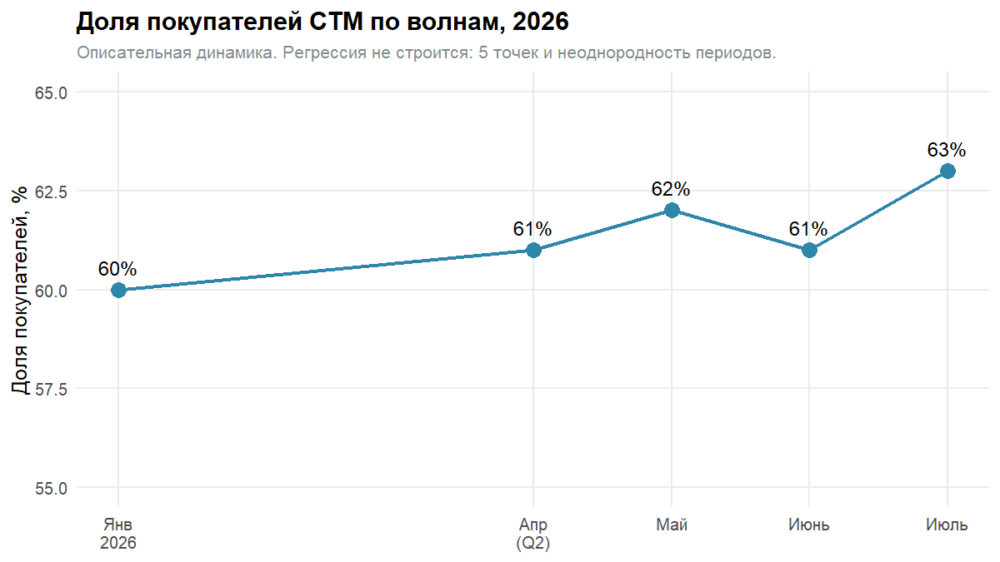

### H2. Ценовой компонент не растёт

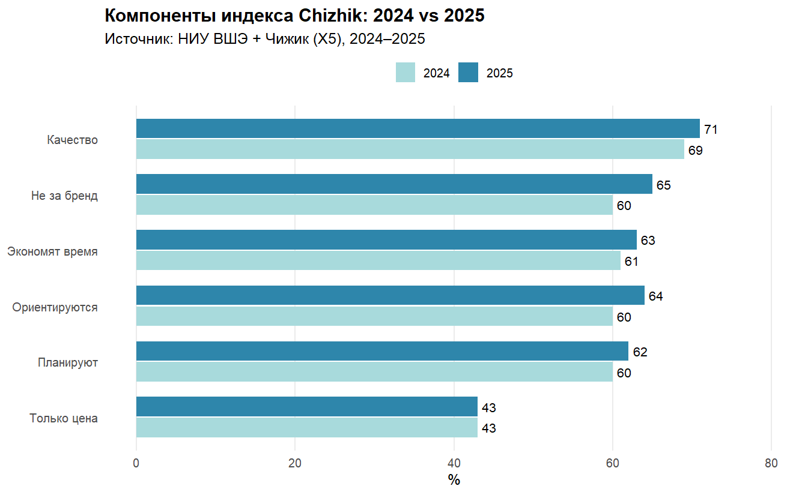

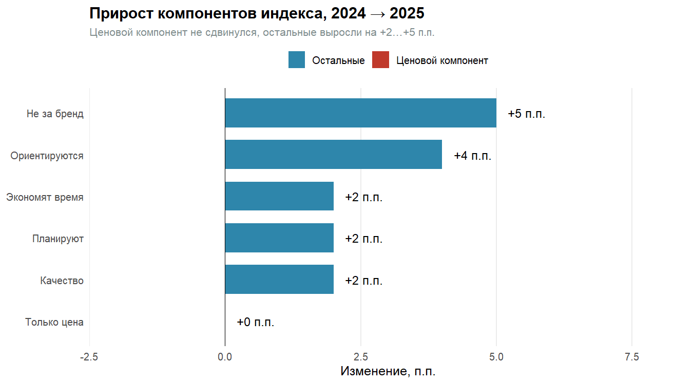

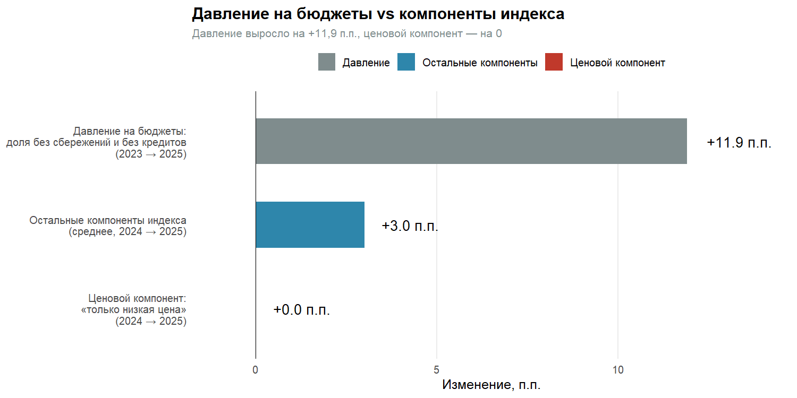

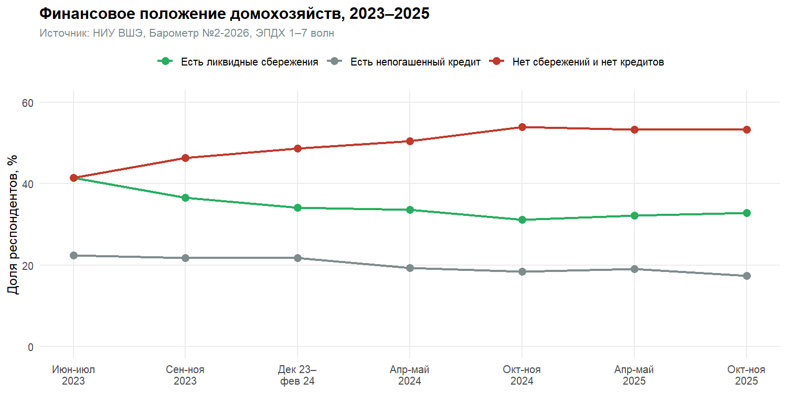

### H3. Отставание 45–54

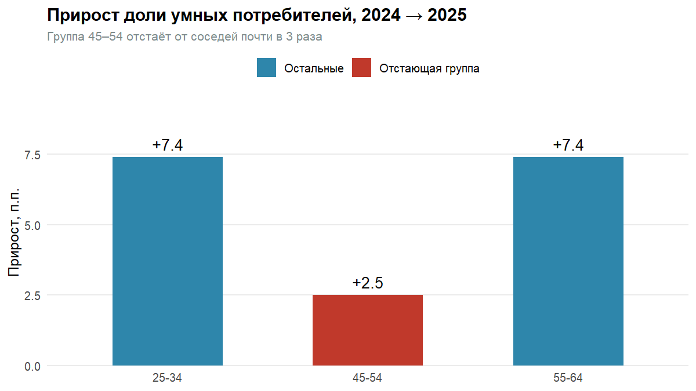

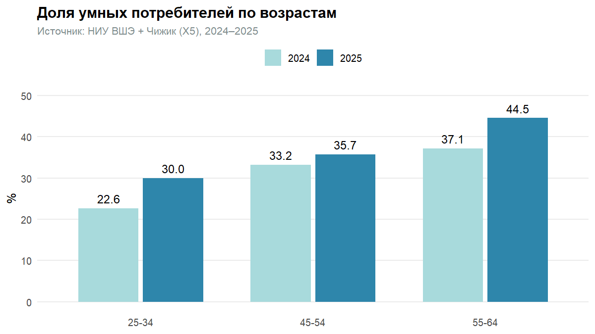

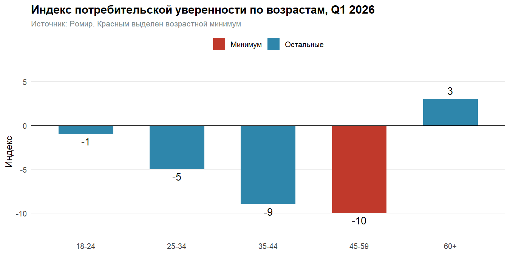

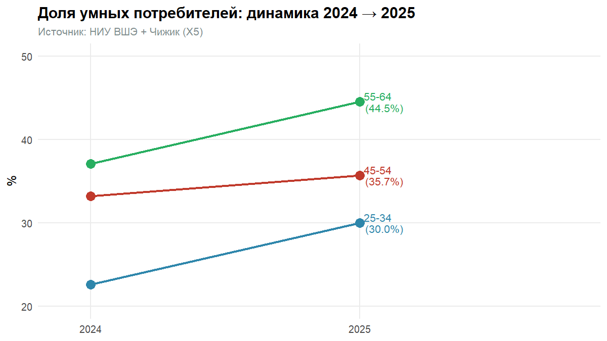

### Региональный разрез

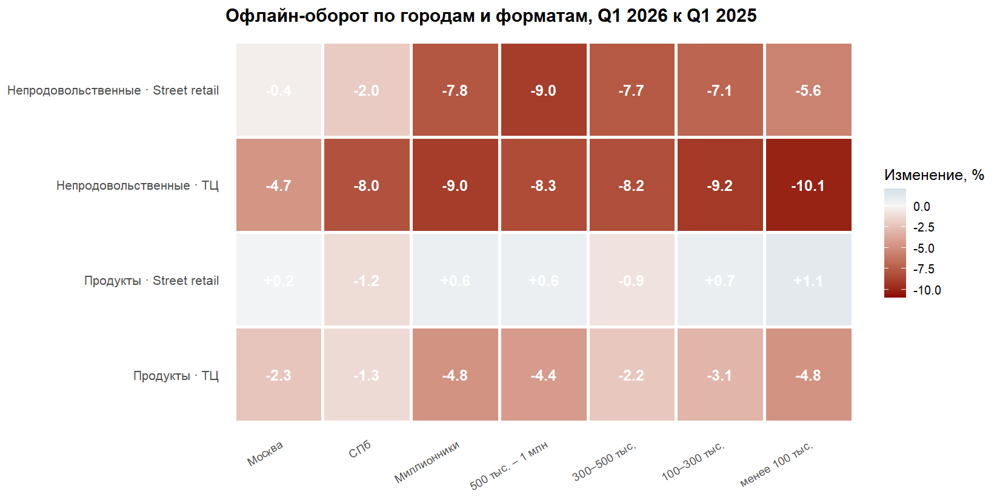

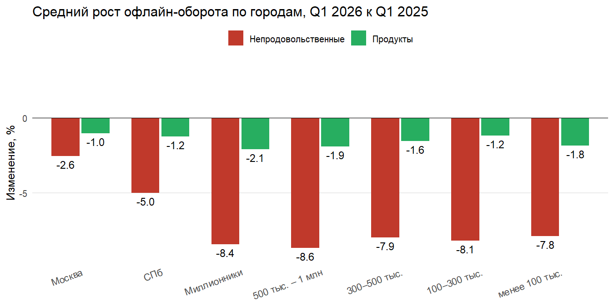

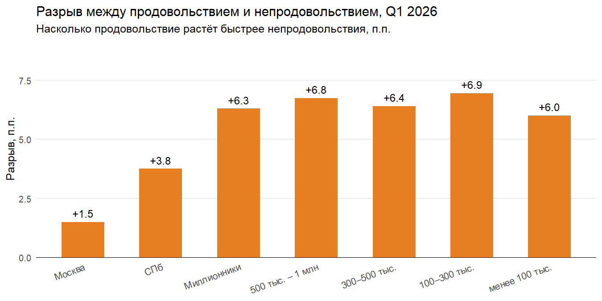

## Ограничения

- **Причинность не измеряется.** Все гипотезы описательные.
  Данные позволяют фиксировать связь между показателями,
  но не устанавливать направление влияния.
- **Источники неоднородны.** Ромир, СберИндекс, ВШЭ и
  Росстат используют разные методологии, выборки и периоды.
  Прямое сопоставление показателей ограничено.
- **Панельных данных нет.** Нельзя различить, тратит ли
  конкретное домохозяйство накопленное или перестало
  откладывать. Все выводы — на уровне агрегатов.
- **H3 устойчив по направлению, но не по значимости.**
  Точных размеров возрастных подгрупп в источниках нет,
  используется sensitivity analysis с диапазоном оценок.
- **Региональный разрез — только офлайн.** Онлайн по городам
  не разбит, поэтому неизвестно, куда уходит
  непродовольственный спрос в малых городах.

## Стек

- **SQL** (SQLite) — аналитические запросы, 24 таблицы
- **R** (dplyr, ggplot2, tidyr) — проверка гипотез, визуализация

---

Ирина Ильина, 2026

