# Умное потребление в России: data-driven анализ

Исследовательский проект о трансформации потребительского поведения 
в России после 2022 года. На основе данных НИУ ВШЭ + «Чижик», Ромир, 
СберИндекс, Росстат, ВЦИОМ.

## Исследовательские вопросы

1. Какие факторы значимо влияют на умное потребление?
2. Можно ли выделить типы умных потребителей (по категориям трат)?
3. Какой будет доля умных потребителей к 2028 году?

## Гипотезы и результаты

| # | Гипотеза | Статус | Метод |
|---|---|---|---|
| H1 | Возраст влияет на умное потребление сильнее, чем пол | подтверждена | range, ANOVA |
| H2 | Финансовая осторожность и умное потребление растут синхронно | подтверждена | временные ряды |
| H3 | Умное потребление ≠ экономия | подтверждена | дескриптивный анализ |
| H4 | Доля умных достигнет 44–46% к 2028 | подтверждена | три сценария |
| H5 | Товарные категории делятся на 3 типа по динамике | подтверждена | k-means, PCA |

Подробнее — в [`hypotheses.md`](hypotheses.md).

## Ключевые результаты

- Доля умных потребителей: **32% → 37%** за год (+5 п.п.)
- **Возраст** влияет на умное потребление в **27 раз сильнее**, чем пол
- **«Только цена»** не изменилось за год (43% → 43%) — умное ≠ экономия
- Прогноз: **46% умных потребителей к 2028** (диапазон 43–51%)
- Кластеры категорий: **растущие** (Маркетплейсы, Мед. услуги), **умеренные** (ЖКУ, Общепит), **снижающиеся** (Мебель, Стройка, Одежда)

## Стек

- **SQL** (SQLite) — хранение и выборка данных
- **Python** (pandas, matplotlib) — загрузка данных, EDA, визуализация
- **R** (dplyr, ggplot2) — регрессия, кластеризация, прогноз
- **BI** — дашборд в Power BI

## Структура
├── data/
│ ├── raw/ # исходный Excel
│ └── smart_consumption.db # 24 таблицы SQLite
├── python/
│ └── 01_load.ipynb # загрузка данных + 9 графиков
├── r/
│ ├── H1.R # рейтинг факторов
│ ├── H2.R # синхронность трендов
│ ├── H4.R # прогноз 2028
│ └── H5.R # кластеризация категорий
├── sql/ # SQL-запросы
├── visualizations/ # 12 графиков
└── hypotheses.md # список гипотез и результатов

## Графики

### Тренды умного потребления

**Рост покупок СТМ (60% → 63%)**
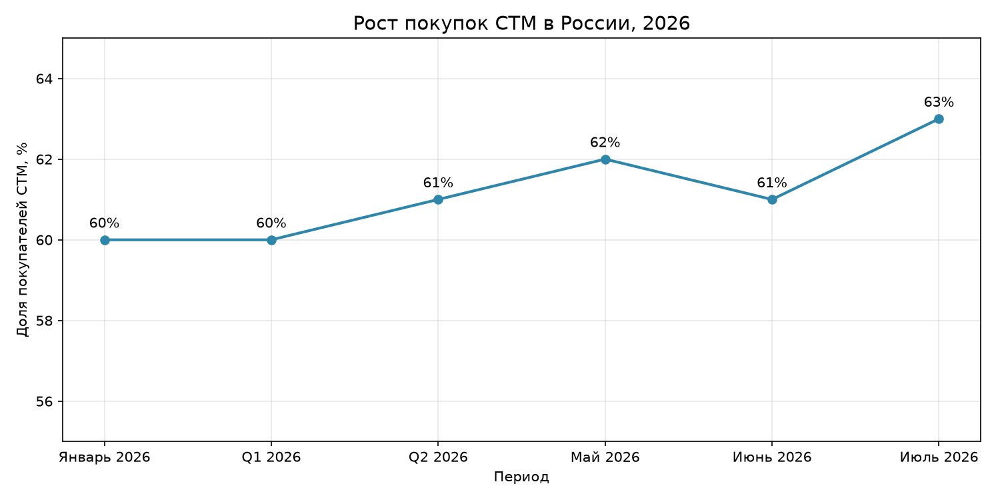

**Финансовое поведение домохозяйств 2023–2025**
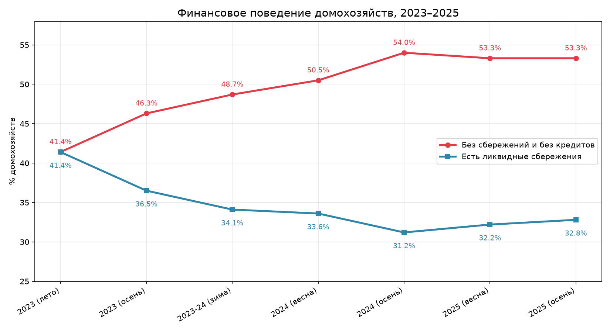

**Индекс умного потребления: 8 параметров**
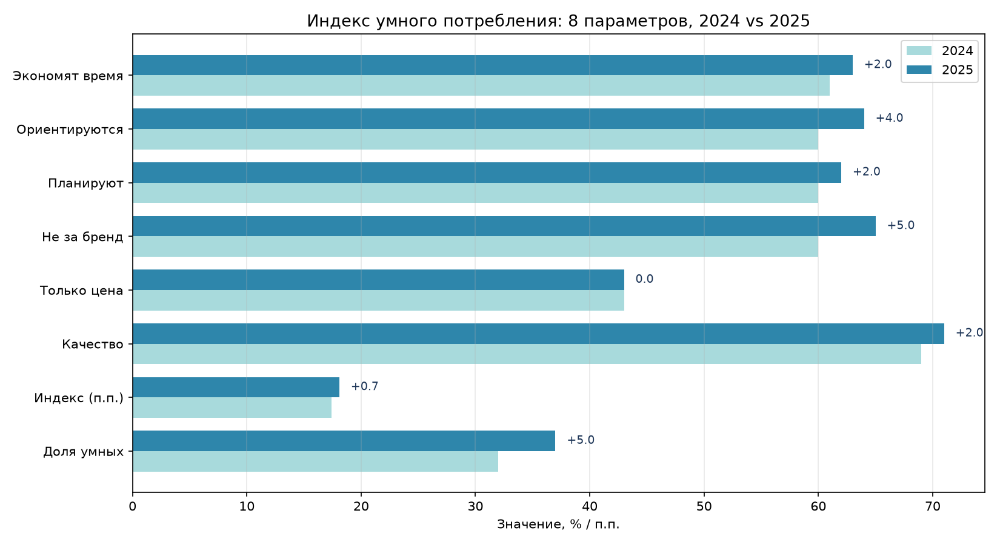

### Перераспределение трат по категориям

**Рост и падение категорий, апр-май 2026**
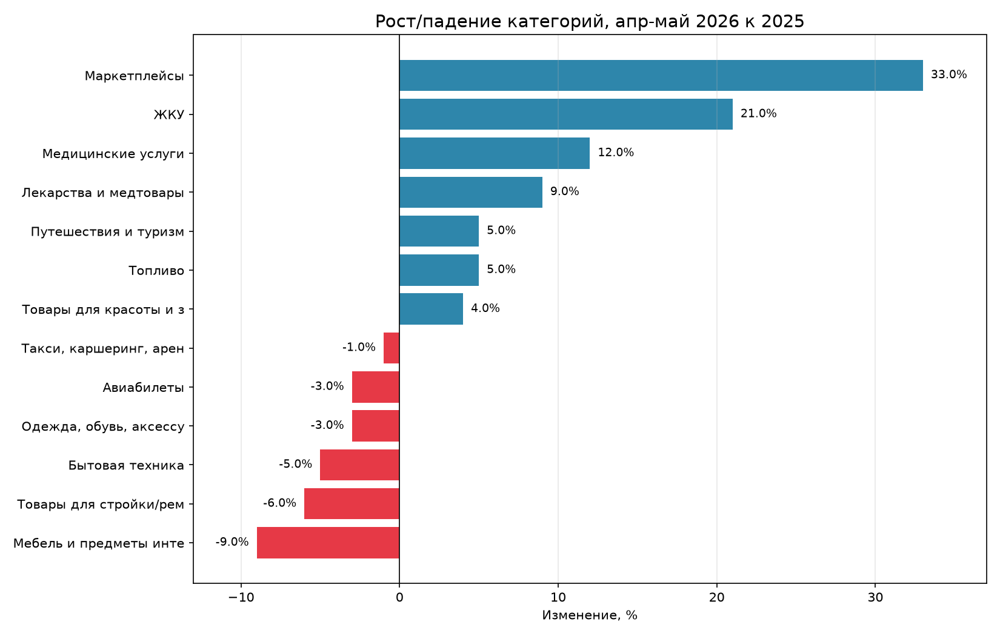

**Оборот розницы 2025 vs 2026**
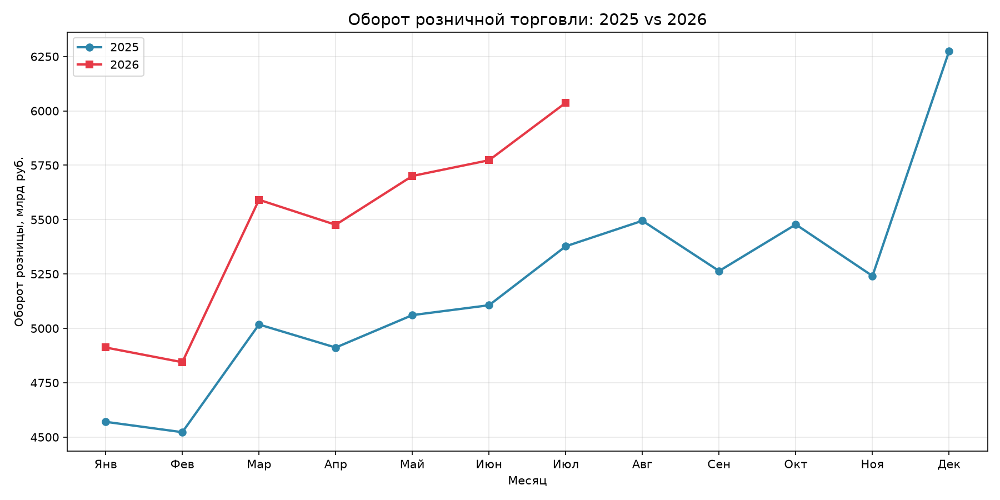

### Гипотезы

**H1: Рейтинг факторов по силе влияния**
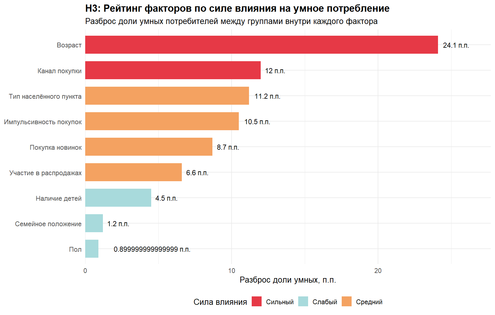

**H2: Финансовая осторожность и умное потребление**
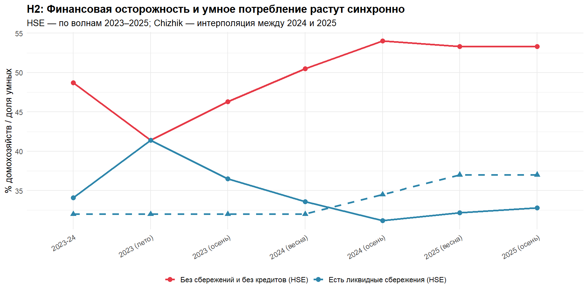

**H3: Умное потребление ≠ экономия**
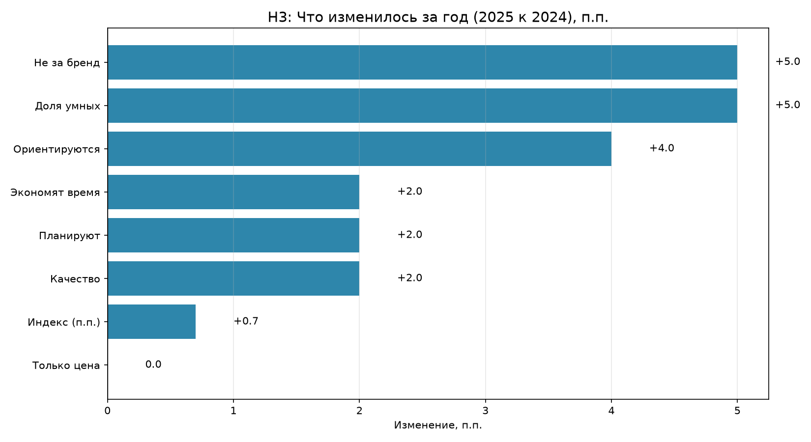

**H4: Прогноз доли умных к 2028**
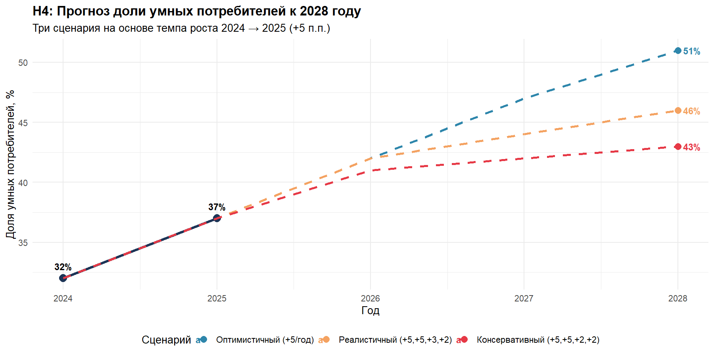

**H5: Кластеризация категорий (PCA)**
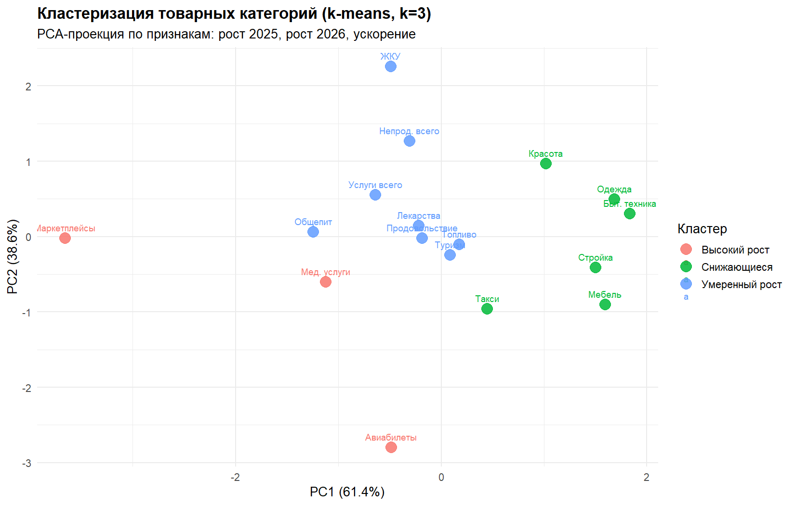

**H5: Рост категорий 2025 vs 2026**
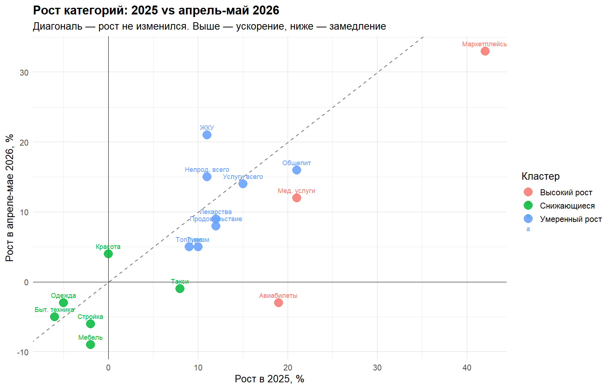

### Дополнительные

**Уверенность по возрасту и размеру семьи**
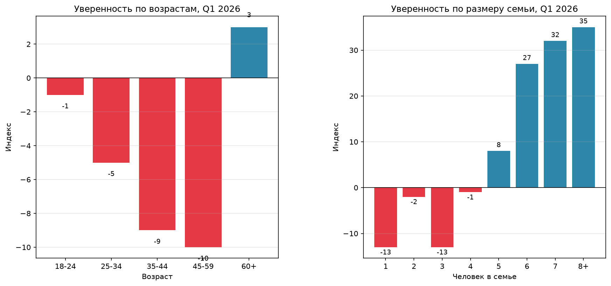

**Топ категорий СТМ**
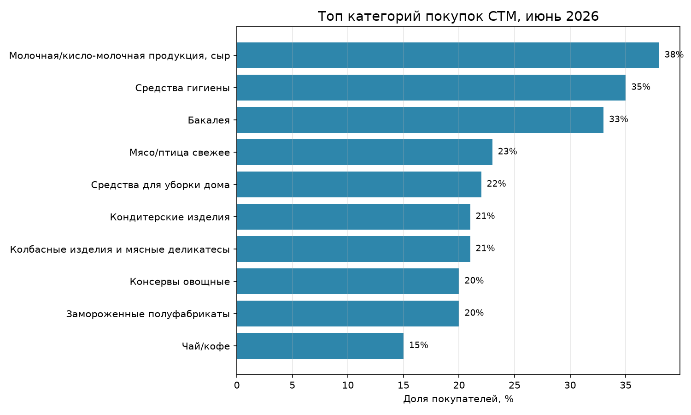

**Мотивация выбора СТМ**
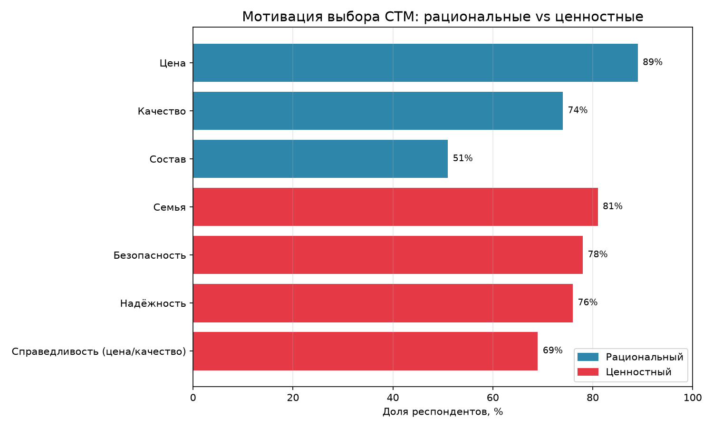

## Источники

- НИУ ВШЭ + «Чижик» (X5) — опрос 6000+ респондентов, 2024-2025
- Ромир — потребительская панель, 2026
- СберИндекс — транзакционные данные, 2025–2026
- Росстат / ЕМИСС — оборот розницы, 2025–2026
- ВЦИОМ / Anketolog — опрос No Buy, 2025

## Автор

Ирина Ильина, 2026

